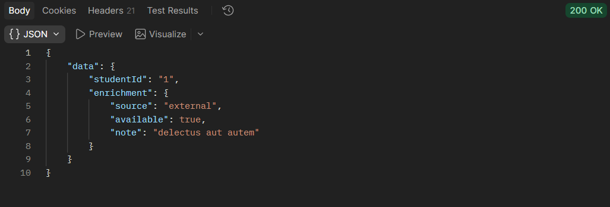
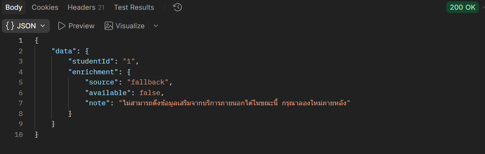

# บันทึกผลการทดสอบ Failure Scenario

| สถานการณ์ | วิธีจำลอง | ผลลัพธ์ที่คาดหวัง | ผลลัพธ์จริง | ผ่าน/ไม่ผ่าน |
|---|---|---|---|---|
| Network error (โดเมนไม่มีอยู่จริง) | เปลี่ยน url เป็น `https://this-domain-does-not-exist-12345.example` | Retry 2 ครั้ง แล้ว fallback พร้อมข้อความชัดเจน | Retry 2 ครั้ง error คือ `getaddrinfo ENOTFOUND` โดย attempt 1 รอ 798ms และ attempt 2 รอ 1458ms (อยู่ในช่วง jitter 500-1000ms และ 1000-2000ms) แล้วคืน 200 พร้อม `source: fallback` | ผ่าน |
| Timeout | ตั้ง `timeoutMs = 1` | เกิด timeout แล้ว retry 2 ครั้ง และ fallback | Retry 2 ครั้ง error คือ `timeout of 1ms exceeded` โดย attempt 1 รอ 561ms และ attempt 2 รอ 1699ms (อยู่ในช่วง jitter 500-1000ms และ 1000-2000ms) แล้วคืน 200 พร้อม `source: fallback` | ผ่าน |
| External API คืน 500 | เปลี่ยน url เป็น mock server (`localhost:4000`) ที่คืน 500 | Retry เนื่องจากเป็น 5xx แล้ว fallback | Retry 2 ครั้ง error คือ `Request failed with status code 500` โดย attempt 1 รอ 729ms และ attempt 2 รอ 1666ms (อยู่ในช่วง jitter 500-1000ms และ 1000-2000ms) แล้วคืน 200 พร้อม `source: fallback` | ผ่าน |

## หลักฐานประกอบการทดสอบ

### ทดสอบปกติ (เรียก external API สำเร็จ)

ได้ 200 และ `source: "external"`

### สถานการณ์ที่ 1 — Network error (โดเมนไม่มีอยู่จริง)

Response ที่ได้เป็น fallback

Log ใน terminal แสดง `getaddrinfo ENOTFOUND` และ retry ครบ 2 ครั้ง (798ms และ 1458ms)

### สถานการณ์ที่ 2 — Timeout

Response ใน Postman ได้ 200 และ `source: "fallback"`

Log ใน terminal แสดง `timeout of 1ms exceeded` และ retry ครบ 2 ครั้ง

### สถานการณ์ที่ 3 — External API คืน 500

Log ใน terminal แสดง `Request failed with status code 500` และ retry ครบ 2 ครั้ง

